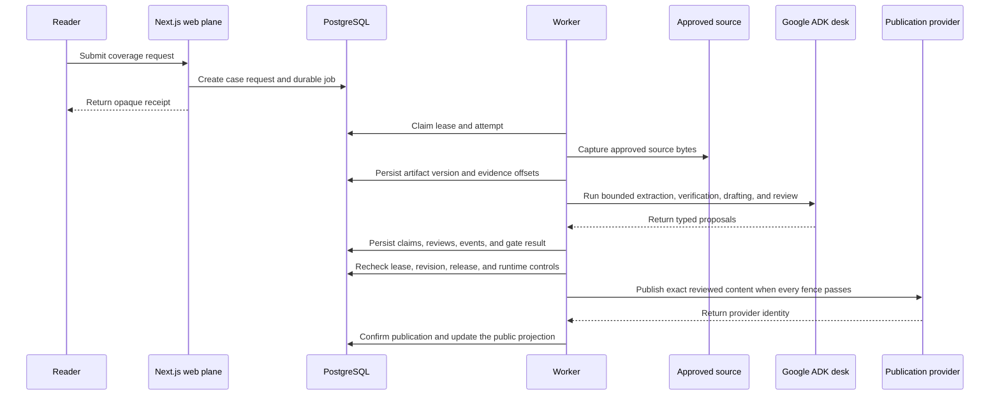

# Public Wire Developer Guide

This guide explains where behavior lives, which layer owns each decision, and how to extend the application without weakening its evidence or publication boundaries.

## 1. Core authority model

Public Wire separates probabilistic proposals from deterministic authority.

| Layer | Responsibility | May publish |
|---|---|---|
| Google ADK agents | Extract, assess, verify, draft, and review structured proposals | No |
| Application policy | Validate evidence coverage, contradictions, revisions, content hashes, and runtime controls | No |
| PostgreSQL | Store canonical investigations, attempts, evidence, reviews, gates, and public projections | No |
| Publication service | Recheck the current database fence and create an idempotent provider intent | Yes, after every gate passes |

ADK session state is execution context. PostgreSQL is product truth. A public page reads a projection rather than raw agent state.

## 2. Request and worker flow



The web process never runs an investigation inline. The worker owns long running execution, and the database connects both processes.

## 3. Repository responsibilities

| Path | Responsibility |
|---|---|
| `app/` | Server rendered pages and route handlers |
| `components/public-wire/` | Reader interfaces for editions, cases, evidence, and workflow playback |
| `lib/adk/public-wire/` | ADK agents, contracts, tools, plugins, and orchestration |
| `lib/investigations/` | Durable state, evidence policy, final gates, projections, and publication |
| `lib/public-wire-view-models/` | Strict public schemas, fixtures, and shared selectors |
| `lib/sponsors/` | Provider adapters with explicit failure outcomes |
| `workers/` | Lease based investigation execution |
| `db/migrations/` | Ordered canonical schema changes |
| `tests/` | Safety, workflow, provider, projection, and compatibility tests |

## 4. Frontend boundaries

Pages remain Server Components unless they require state, effects, browser APIs, or event handlers. Interactive islands use the smallest practical client boundary.

`ReferenceRunExplorer` loads the workflow dialog dynamically. The dialog code is absent from the initial page bundle until a reader opens it. Shared reference selectors build claim and receipt indexes once per run, avoiding repeated linear searches and ensuring that repaired evidence appears on every surface.

The public interface follows one reading order:

1. Resident answer
2. Concrete action and known unknowns
3. Source network
4. Agent contribution
5. Decision thresholds
6. Technical execution record

Motion must explain state change. It must stop, respect reduced motion settings, and never conceal required controls or evidence.

## 5. Reference run contract

Captured runs are parsed by `referenceRunSchema` before rendering. The schema verifies source counts, publisher counts, material claim counts, source text containment, event chronology, loop links, decision links, and publication consistency.

When adding a run:

1. Capture official source text and retain exact displayed excerpts.
2. Give each material claim at least one linked receipt.
3. Model input receipts separately from evidence added during repair.
4. Link every workflow moment to public events, claims, and receipts.
5. Record observed and required values for every decision checkpoint.
6. Use `deterministic_reference` unless the record contains a real ADK trace identity.
7. Add tests that intentionally corrupt the new contract and confirm rejection.

Use `referenceOutputReceipts` for a complete evidence packet and `referenceSourcePages` for unique reader facing source pages. Do not infer source count from receipt count.

## 6. Provider adapters

Every provider adapter returns an explicit mode and outcome. Missing configuration, malformed output, timeouts, and provider errors remain distinct. Callers must fail closed.

Lapdog is represented by the reliability adapter in `lib/sponsors/lapdog-review.ts`. The local reliability logic checks source reachability and uses Gemini to compare every canonical claim with captured source text. `DATADOG_LAPDOG_URL` is an optional result forwarder. `DD_TRACE_AGENT_URL` enables Datadog trace transport. Do not describe a captured reference run as a live Lapdog execution unless a persisted provider trace proves it.

## 7. Verification

Run the complete local gate before opening a pull request:

```bash
npm run typecheck
npm run lint
npm test
npm run eval:public-wire
npm run build
git diff --check
```

Browser verification should cover the landing newsroom, NYC edition, captured briefing, evidence ledger, workflow dialog, keyboard focus return, reduced motion, and a 320 pixel viewport.

## 8. Change checklist

1. Keep secrets and provider clients in server only modules.
2. Preserve opaque public keys and allowlisted event projections.
3. Bind reviews to the exact canonical content hash.
4. Preserve lease and revision checks around every durable mutation.
5. Add a migration for canonical data changes.
6. Add a negative test for every new gate or invariant.
7. Update this guide when ownership or data flow changes.
