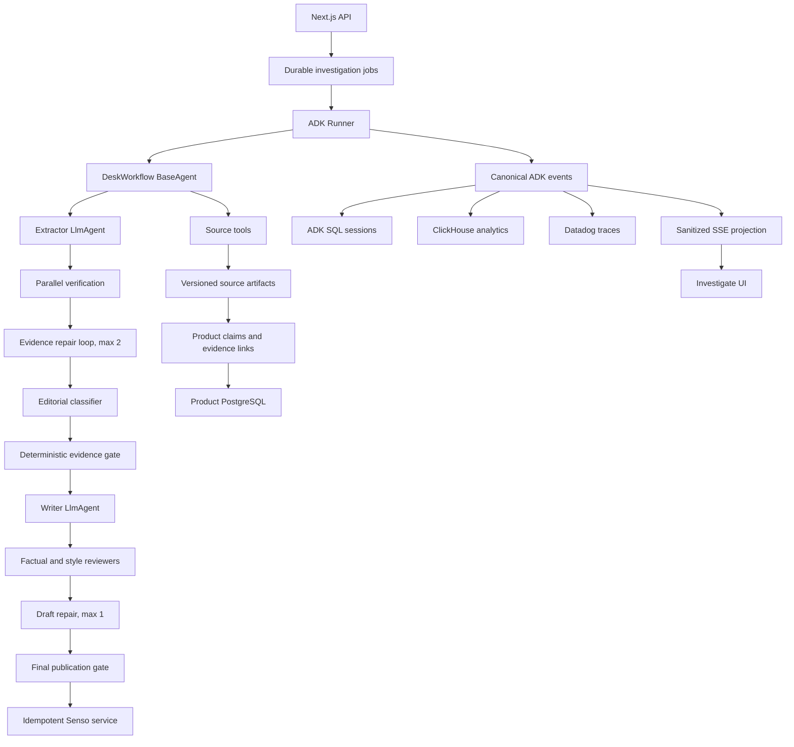

# PublicWire Google ADK Build Plan (No Vertex AI)

Status: implementation-ready proposal, adversarial review incorporated

Scope: migrate PublicWire's LLM orchestration to Google Agent Development Kit (ADK) for TypeScript while continuing to use the Gemini Developer API directly, not Vertex AI

Last updated: 2026-07-19

## 1. Executive decision

PublicWire should adopt Google ADK as its orchestration and execution framework, but it should not translate the current one-shot function into a collection of loosely supervised agents. The migration should first make publication safe, then introduce an ADK workflow with bounded repair loops, canonical events, durable investigations, versioned evidence, and deterministic publication gates.

The recommended product shift is from an "edition generator" to a persistent civic investigation system:

- A scan discovers candidate civic changes.
- Each candidate becomes an investigation with claims and evidence.
- Every material claim is linked to a captured source artifact.
- Verification may request additional evidence, but loops are bounded and must add information.
- Publication is a deterministic side effect after all editorial and reliability gates pass.
- Later scans update the same investigation, allowing agenda-to-outcome tracking, corrections, watchlists, and source-health monitoring.

ADK provides the useful control plane: agents, workflow primitives, sessions, state, events, artifacts, tools, plugins, cancellation, and context compaction. PublicWire remains responsible for newsroom policy, data durability, claim provenance, job execution, user-facing projections, and the final publish decision.

This plan deliberately excludes Vertex AI. It uses `GEMINI_API_KEY` with the Gemini Developer API. GCP services that do not require Vertex, such as Cloud Storage or Cloud SQL, may remain optional infrastructure choices behind interfaces; local and non-GCP implementations must also work.

## 2. Goals, non-goals, and success criteria

### Goals

1. Eliminate every known fail-open or publish-before-review path.
2. Replace manual LLM orchestration with an observable, testable ADK workflow.
3. Add claim-level, artifact-backed provenance rather than prose-only evidence strings.
4. Preserve provider boundaries: Nimble for discovery, Gemini through ADK for reasoning and writing, ClickHouse for analytics, and Senso for publication.
5. Make investigations durable and resumable across separate requests at the product layer.
6. Stream real execution events to the Investigate UI.
7. Create bounded loops that improve evidence or drafts without runaway model calls.
8. Enable future civic newsroom features without coupling the product to Vertex AI.
9. Support a staged migration with legacy, shadow, and ADK modes plus an immediate rollback switch.

### Non-goals for the initial migration

- Replacing Nimble, ClickHouse, Datadog, or Senso solely because ADK is introduced.
- Giving an LLM direct access to publication, database mutation, arbitrary HTTP, or secrets.
- Building an open-ended autonomous newsroom.
- Depending on TypeScript features that are documented only for Python, Go, or Vertex-hosted deployments.
- Treating ADK's in-memory session or memory services as production storage.
- Migrating the Next.js application to a separate agent service before an embedded worker proves insufficient.
- Adding speculative multi-agent roles that do not produce a measurable quality, safety, or latency benefit.

### Program-level success criteria

- A held, malformed, timed-out, errored, or reliability-rejected item can never reach Senso.
- Every material published claim has at least one persisted evidence link to a versioned source artifact.
- The system exposes stable investigation, invocation, event, claim, artifact, and publication identifiers.
- The UI trace is projected from canonical events; it does not invent timestamps or prompts.
- All repair loops have hard iteration, wall-clock, tool-call, and token limits.
- Shadow-mode output is reviewed against an approved civic-document benchmark before ADK becomes primary.
- Production can switch orchestration modes through a durable runtime flag without a schema rollback. After provenance cutover, legacy may publish only through the same evidence contract, gates, and publication service; otherwise legacy rollback is read/hold-only.
- No Vertex configuration, SDK, endpoint, deployment, or credential is needed to run the application.

## 3. Current baseline and defects to address first

### Current architecture

`lib/public-wire-agent.ts` is a single synchronous orchestrator that performs this sequence:

1. Nimble source scan and structured extraction.
2. ClickHouse context lookup and title-based deduplication.
3. Gemini editorial review of the first surviving candidate.
4. At most one Nimble rescan when that review says `unsupported`.
5. Gemini writer.
6. Gemini mentor.
7. Senso publication.
8. Lapdog reliability review.
9. ClickHouse ledger write.

Gemini calls are direct `@google/genai` calls in `lib/sponsors/`. The repository does not currently use `@google/adk`, ADK agents, an ADK runner, ADK sessions, plugins, artifacts, or canonical ADK events.

### Launch-blocking correctness issues

These are Phase 0 work, not migration cleanup to postpone:

| Issue | Current behavior | Required behavior |
| --- | --- | --- |
| Held item remains resolved | `resolvedChange` starts as the lead candidate and is not cleared for most editorial holds | A candidate is publishable only after an explicit, valid approval and all later gates |
| Mentor fails open | Missing key, malformed JSON, or request error can auto-approve | Production fails closed; demo behavior is explicit, labeled, and incapable of external publishing |
| Reliability can fail open | A missing adversarial result passes, zero sources satisfy the reachability threshold, and the Gemini timeout signal is never passed to the request | Every required review returns a typed pass; skipped, unavailable, malformed, timed-out, errored, zero-source, or missing-evidence results hold |
| Reliability review is late | Senso is called before Lapdog | Reliability review precedes the final deterministic gate and every publication side effect |
| Senso failure returns a local ID | The wrapper derives `citationId` from a slug even after an API error | Only a provider-returned and verified remote identifier confirms publication; ambiguous outcomes enter reconciliation |
| Candidate count masquerades as publication | `briefsPublished` is derived before actual publish success | Count a publication only after Senso returns a verified success identifier |
| Only the first candidate is reviewed | Later candidates can remain in `published` and appear in projections | Process each candidate independently or return a single explicitly selected candidate |
| Evidence is prose only | `LocalChange.evidence` is `string[]` | Claims reference captured source versions, excerpts, offsets, hashes, and verification events |
| Trace is synthetic | Edition adapter recreates prompts and assigns render-time timestamps | Persist actual canonical events and project redacted reader-facing views from them |
| Request is long and synchronous | Edition route waits for the full scan | Move production runs to durable jobs; return a job/investigation identifier and stream status |
| Coverage state is process-local | Coverage requests use an in-memory `Map` | Persist requests, apply idempotency, rate limits, ownership, and lifecycle states |
| Raw provider output can leak | Scan results retain raw provider responses | Store raw content as restricted artifacts; never return it in public route payloads |
| Dedup is title-based and short-lived | Area + title hash with a six-hour window | Add source-content and claim fingerprints while keeping editorially meaningful update detection |

## 4. Architectural principles

1. **Deterministic shell, probabilistic core.** Agents extract, classify, compare, and draft. Code owns invariants, budgets, state transitions, authorization, and publication.
2. **Evidence before prose.** Drafting cannot begin until an evidence matrix exists and passes schema and policy validation.
3. **Events are facts, UI traces are views.** Ingest canonical events idempotently, then derive internal, sponsor, and reader-safe projections through at-least-once delivery.
4. **A loop must buy information.** Repeat only after new source content, a changed evidence matrix, or precise editorial feedback; never ask the same model the same question repeatedly.
5. **External side effects are isolated.** Senso publication is not an agent tool. An application service invokes it after the final gate using a durable intent and reconciliation protocol that provides effectively-once product behavior.
6. **Provider outputs are untrusted.** Validate all model and tool output with Zod, enforce size and URL rules, and treat downloaded text as prompt-injection-capable data.
7. **Durability belongs to product storage.** ADK sessions and artifacts support execution; product tables define the investigation and publication record.
8. **Shadow before cutover.** ADK may read production inputs in shadow mode but cannot publish or alter canonical product decisions.
9. **No invisible fallback.** Real, demo, degraded, and failed modes are separate typed states. Production cannot silently substitute seeded data.
10. **Version everything that affects a decision.** Store model, prompt, schema, policy, tool, source, and artifact versions.

## 5. Target architecture



### Execution placement

- Development: embedded ADK runner with in-memory session and artifact services, started from server-only code.
- Production: never assume `workers/*.ts` is started by Next.js or a serverless host. Use either a separately deployed long-lived worker or a queue-triggered bounded function selected in the Phase 1 topology spike. The choice must define leasing, connection pools, shutdown/cancellation, health checks, maximum invocation duration, and SSE/proxy behavior before shadow traffic is enabled.
- Scale-out option: change worker packaging or concurrency only through the runner and service interfaces; do not rewrite workflow logic around a hosting product.
- ADK Web and ADK API Server are development/testing utilities only; they are not the PublicWire production API.

### Identity model

- `appName`: `public-wire` plus environment suffix.
- ADK `userId`: `town:<townSlug>` for autonomous desk work; a separate opaque user identifier for personalized requests if later needed.
- ADK `sessionId`: `investigation:<investigationId>`.
- Product `jobId` identifies one logical unit of work, such as a scan, source refresh, appeal, correction, or scheduled check.
- Each retry creates a `jobAttemptId`. An attempt maps to at most one ADK invocation; TypeScript retries start from persisted product checkpoints rather than assuming ADK workflow-resume support.
- The application emits `job_attempt.started` before calling the runner, when no ADK invocation ID exists. It binds the ADK-generated `invocationId` after the first runner event. Pre-run application events therefore have no `invocationId`.
- Only one mutating attempt may own an investigation/session at a time. An investigation lease or partial unique constraint plus optimistic revision checks prevents a refresh, correction, and retry from racing.
- `publicationId` is created only after the final gate and is associated with an immutable investigation revision and content hash through a durable publication intent.
- All identifiers above are internal. Reader APIs use separate opaque, non-sequential `publicCaseKey`, `jobReceiptKey`, `publicClaimKey`, `publicReceiptKey`, and `publicEventKey` values created by the public-projection layer. Internal investigation/job/session/invocation/artifact/event identifiers never appear in public URLs or payloads.
- Town scope is resolved from a server-owned area registry, never from arbitrary route/query display text.

## 6. ADK capability map

| PublicWire need | ADK capability | Planned use | Boundary or caveat |
| --- | --- | --- | --- |
| Typed model roles | `LlmAgent` | Extractor, editor, writer, claim verifier | Output still requires Zod validation and policy checks |
| Fixed ordering | `SequentialAgent` or custom workflow code | Simple subflows where every step always runs | Main workflow is conditional, so use a custom `BaseAgent` |
| Independent checks | `ParallelAgent` | Source reachability, claim support, novelty, and resident relevance checks | Run only independent work in parallel and cap concurrency |
| Evidence repair | `LoopAgent` or explicit bounded loop inside `BaseAgent` | Up to two evidence-improving attempts | Exit requires new artifact/content hash or terminal classification |
| Conditional orchestration | custom `BaseAgent` | The primary desk workflow | Keep final side effects outside the agent |
| Tool contracts | `FunctionTool` | Read-only discovery, source fetch, prior claim search, artifact lookup | No arbitrary fetch, SQL, filesystem, or publish tool |
| Existing tool ecosystems | `MCPToolset` | Later civic connectors such as Socrata, Legistar, Granicus, and GTFS | Add one server at a time with scopes, allowlists, and contract tests |
| Shared safeguards | `BasePlugin` callbacks | Provenance, source safety, budgets, caching, and policy telemetry | Final publication gate remains explicit application code |
| Execution history | sessions, state, events | Invocation continuity and canonical execution audit | Product truth also lives in normalized product tables |
| Large/raw evidence | artifact services | HTML, PDF, normalized text, evidence matrices, and drafts | Do not place large documents or secrets in session state |
| Stop runaway work | `AbortSignal` cancellation | Wall-clock and user cancellation across runner, models, tools, callbacks | Tools must honor the signal and their own timeouts |
| Long investigations | context compaction | Compact older event history while retaining structured state/artifacts | Test summaries for evidence loss before enabling |
| Web corroboration | `GoogleSearchTool` | Optional dedicated corroboration agent | Keep separate from broad tool agents; preserve citations and required search attribution UI |
| Reusable town knowledge | experimental ADK Skills | Later town/source playbooks | Experimental; never a launch dependency |
| Deterministic routing | `RoutedAgent` | Later route by source/document type | Experimental adoption follows measured routing needs |

### TypeScript features not assumed by this plan

Do not design the critical path around graph workflows documented for other languages, Python-only evaluation tooling, Python-only rewind/resume behavior, Python OpenAPI tool generation, Computer Use, mature A2A deployment, Vertex-managed semantic memory, or Vertex deployment services. Re-check the exact installed `@google/adk` version before every experimental phase because the TypeScript surface is evolving.

## 7. Proposed repository structure

Introduce a new namespace without immediately moving or deleting the legacy implementation:

```text
lib/adk/public-wire/
  config.ts                         # env parsing, feature flags, budgets, versions
  contracts.ts                      # Zod schemas and inferred domain types
  runner.ts                         # runner construction and service injection
  invoke.ts                         # invocation wrapper, cancellation, event consumption
  agents/
    extractor.ts
    editorial-classifier.ts
    claim-verifier.ts
    writer.ts
    factual-reviewer.ts
    search-corroborator.ts          # optional Google Search-only agent
  tools/
    nimble-search.ts
    source-fetch.ts
    prior-claims.ts
    source-reachability.ts
    artifact-reader.ts
  plugins/
    provenance.ts
    publication-policy.ts
    evidence-cache.ts                 # deferred until benchmark-backed
    source-safety.ts
    execution-budget.ts
  workflows/
    desk-workflow.ts
    evidence-repair.ts
    draft-repair.ts
  services/
    session-service.ts
    artifact-service.ts
    event-sink.ts
    publication-service.ts
  projections/
    public-event.ts
    legacy-scan-result.ts
```

Additional application-level modules:

```text
lib/investigations/
  repository.ts
  job-repository.ts
  claim-repository.ts
  state-machine.ts
  publication-gate.ts
  dedup.ts
app/api/public-wire/investigations/route.ts
app/api/public-wire/investigations/[id]/route.ts
app/api/public-wire/investigations/[id]/events/route.ts
app/api/public-wire/jobs/[id]/route.ts
workers/public-wire-investigation.ts
```

Existing files remain adapters during migration:

- `lib/public-wire-agent.ts` becomes a facade that chooses `legacy`, `shadow`, or `adk` execution.
- `lib/sponsors/*.ts` remain provider wrappers initially, then become tool or agent adapters.
- `lib/public-wire-edition-adapter.ts` consumes the canonical public projection instead of synthesizing trace details.
- `lib/datadog-trace.ts` accepts invocation/event correlation identifiers and records agent/tool/model metadata.
- Current API routes remain backward-compatible until the UI switches to investigation/job endpoints.

## 8. Core contracts and data model

Define all model and tool boundaries as strict Zod schemas. Reject unknown or malformed critical fields; do not coerce approval values with `Boolean(...)`.

### Source artifact

```text
SourceArtifact
  artifactId                  stable product identifier
  artifactKind                raw | normalized | evidence-matrix | draft | other
  adkArtifactName             ADK artifact key
  adkArtifactVersion          immutable version number
  investigationId
  sourceId
  sourceUrl
  canonicalUrl
  mediaType
  fetchedAt
  effectiveAt?                date represented by the document
  contentHash                 hash of this artifact's bytes
  derivedFromArtifactId?      raw source artifact for a normalized derivative
  derivedFromArtifactVersion?
  normalizerVersion?          required for normalized derivatives
  fetchMethod                 nimble | direct | mcp | upload
  httpStatus?
  accessClassification        public | internal-restricted
  storageUri
  metadata                    title, publisher, language, page count, etc.
```

### Claim and evidence link

```text
Claim
  claimId
  investigationId
  revision
  normalizedText
  claimType                   date | location | action | impact | attribution | other
  importance                  material | contextual
  status                      proposed | supported | disputed | unsupported | superseded
  createdByEventId
  promptVersion
  schemaVersion

EvidenceLink
  evidenceLinkId
  claimId
  artifactId
  artifactVersion
  sourceUrl
  supportingExcerpt
  startOffset?
  endOffset?
  pageNumber?
  relation                     supports | contradicts | contextualizes
  sourceAuthority              official | first-party | public-secondary | unknown
  extractorEventId
  verifierEventId?
  verifiedAt?
  confidence                   bounded numeric value used for ranking, not automatic truth
```

### Evidence matrix

The matrix is the contract between extraction, verification, editorial review, and writing:

```text
EvidenceMatrix
  investigationId
  revision
  candidateId
  claims[]
  evidenceLinks[]
  contradictions[]
  missingEvidence[]
  sourceDiversity
  officialSourceCount
  contentFingerprint
  createdByInvocationId
  policyVersion
```

### Workflow decision

```text
WorkflowDecision
  outcome                      publish | hold | reject | needs_evidence | needs_revision
  reasonCodes[]                enum, never free text alone
  explanation                  internal explanation
  blockingClaimIds[]
  suggestedQueries[]           only for evidence repair
  eventId
  policyVersion
```

### Canonical event envelope

Persist ADK event fields without changing their meaning, then add application correlation:

```text
PublicWireEventEnvelope
  eventId
  origin                      adk | application
  adkEventId?                 present only for ADK-native events
  invocationId?               absent before the first ADK runner event
  jobId
  jobAttemptId
  investigationId
  appName
  userId
  sessionId
  author
  branch?
  eventType
  occurredAt
  persistedAt
  stateDelta?                  redacted, size-limited
  artifactDelta?
  toolName?
  toolCallId?
  model?
  modelRequestId?
  promptVersion?
  usage?                       input/output/cached token metadata when available
  finishReason?
  errorCode?
  latencyMs?
  contentHash?
  parentEventId?
  visibility                   internal | sponsor | public
  payload                      validated, versioned payload
```

Application events and ADK-native events share the envelope but retain distinct `origin` and identifier rules. ADK event ingestion is idempotent on `(appName, userId, sessionId, adkEventId)`; application events use their own unique `eventId`.

Canonical envelopes remain internal. A separate public-projection contract applies an independent `private | unlisted | public` disclosure decision, maps events to allowlisted public codes with typed safe parameters, replaces internal identifiers with opaque public keys, redacts/moderates claim text and excerpts, and assigns projection revision/snapshot cursor/stream epoch. Workflow status never grants disclosure by itself.

Never store API keys, cookies, raw authorization headers, full hidden prompts, or unrestricted raw model/tool bodies in analytics. Restricted raw bodies belong in encrypted artifacts with retention controls, only if genuinely needed.

## 9. Persistence layers and ownership

| Layer | Owns | Does not own |
| --- | --- | --- |
| ADK SQL session service | ADK sessions, state deltas, invocation events | Product investigation lifecycle or publication record |
| Product PostgreSQL | investigations, candidates, claims, evidence links, coverage requests, jobs/attempts, review decisions, publication intents/publications, runtime controls, canonical event envelopes, and the projection outbox | Large raw documents or high-volume analytics |
| Artifact service | immutable raw and normalized source versions, model intermediates, drafts | Searchable relational lifecycle state |
| ClickHouse | event/metric mirror, source and claim performance, dedup analytics, cost and latency | Transactional authorization or final publication truth |
| Datadog | operational traces, errors, service health, alerting | Editorial record of authority |
| Senso | externally published, citable artifact | Pre-publication evidence and workflow state |

### Environment choices

- Local tests: fake session/artifact services wherever possible; in-memory ADK services for integration tests; temporary PostgreSQL/FileArtifactService for persistence tests.
- Development: in-memory session service is acceptable only for disposable runs; file-backed artifacts must be outside public web roots.
- Production: ADK `DatabaseSessionService` behind a constructor interface, PostgreSQL for product state, and a durable artifact implementation. `GcsArtifactService` is an optional no-Vertex choice; a non-GCP implementation must remain possible.
- Memory: do not use `InMemoryMemoryService` for production recall. Start with a `search_prior_claims` read-only tool over product PostgreSQL/ClickHouse. Introduce a custom `BaseMemoryService` only when semantic retrieval quality and storage ownership are specified and evaluated.

### Required product tables

1. `area_registry`: canonical town/tenant key, display name, timezone, source policy, and enabled status.
2. `investigations`: canonical area key, topic, independent workflow/publication/lifecycle/correction/freshness fields, current revision, lifecycle timestamps, policy version.
3. `investigation_candidates`: discovery input, source fingerprint, extraction status, selection decision.
4. `claims`: normalized claim text, type, materiality, status, revision, creating event.
5. `source_artifacts`: immutable artifact/version metadata, kind, derivation relationship, normalizer version, and hashes.
6. `evidence_links`: claim-to-artifact excerpt/offset relationships and verification state.
7. `workflow_decisions`: structured outcomes, reason codes, blocking claims, actor/event.
8. `investigation_jobs`: logical work item, requested revision/operation, idempotency key, and terminal state.
9. `investigation_job_attempts`: attempt number, investigation/session lease, heartbeat, generated ADK invocation binding, checkpoint, cancellation, retry class, and failure.
10. `publication_intents`: unique investigation revision/content hash, state (`pending | confirmed | unknown | failed`), provider key/slug, attempt metadata, and reconciliation state.
11. `publications`: confirmed investigation revision, gate result, provider-returned Senso id/URL, content hash, status, and immutable public revision relationship.
12. `coverage_requests`: normalized request, requester scope, status, idempotency key, rate-limit data.
13. `corrections`: typed update/clarification/correction/retraction, affected claims, rationale code, effective time, and prior/replacement confirmed publication relationship.
14. `investigation_disclosures`: independent private/unlisted/public decision, policy/actor, approved claims/events/receipts, and effective/revoked times.
15. `public_case_keys`: opaque/revocable case and requester receipt keys mapped internally; never reuse internal IDs.
16. `public_projection_snapshots`: schema version, public case key, disclosure, projection revision, snapshot cursor, stream epoch, orthogonal state fields, and redacted reader-safe payload.
17. `public_event_projections`: public event key, case key, cursor/epoch, allowlisted event code, typed safe parameters, and approved public claim/receipt references.
18. `runtime_controls`: fail-closed canonical-mode selector, publication kill switch, rollout scope, version, actor, and audit time.
19. `admission_quotas`: durable per-town/requester budgets, window, usage, and shadow sampling policy.
20. `event_envelopes`: durable canonical application/ADK envelopes, uniqueness on the ADK event key, and a monotonic per-investigation cursor/sequence for replay and SSE.
21. `event_outbox`: idempotent downstream delivery records for ClickHouse, Datadog, and public projection/SSE work; it is not the canonical event store.

Migrations must be forward-only, transactionally safe, and independently deployable before the code that writes new columns. Backfills need restartable checkpoints and must never infer evidence that was not captured.

## 10. Workflow specification

### 10.1 Invocation preparation

1. Load the investigation, acquire the job-attempt lease, and acquire the exclusive mutating lease for the investigation/session.
2. Enforce idempotency using `(investigationId, requestedRevision, operation, inputFingerprint)` and verify that the requested revision is still current.
3. Create or retrieve the ADK session.
4. Persist `job_attempt.started` without an invocation ID, then call the runner and bind its generated invocation ID when the first ADK event arrives.
5. Build invocation context containing only identifiers, budgets, town policy, and artifact references.
6. Start an `AbortController` with wall-clock deadline and cancellation propagation, including legacy provider requests during migration.
7. Before every state transition and before publication, re-check lease ownership and the optimistic investigation revision. A stale attempt may retain audit artifacts/events but cannot mutate current state or publish.

### 10.2 Discovery and capture

1. The Nimble tool accepts a constrained town, topic, source categories, time window, and maximum results.
2. Validate returned URLs and metadata.
3. Capture each chosen raw source under an immutable raw artifact key before extraction.
4. Normalize text deterministically and save it under a distinct normalized artifact key, linked to the raw artifact/version with `derivedFrom` and `normalizerVersion` metadata. ADK versions are revisions of one logical artifact, not a way to mix raw and normalized media.
5. Record raw and normalized hashes, fetch time, source authority, derivation, and acquisition tool call. Byte-level storage deduplication is an optional backend optimization, not an ADK artifact guarantee.
6. Deduplicate exact source bytes, then compare semantic claim fingerprints separately.

The model sees bounded normalized excerpts through an artifact reader; it does not receive an unrestricted network or filesystem tool.

### 10.3 Extraction

The extractor produces candidates, atomic material claims, evidence excerpts, source offsets/pages, affected groups, dates, locations, and explicit unknowns. A deterministic validator checks:

- every evidence link resolves to the specified artifact version;
- excerpts match normalized source text;
- offsets/page references are valid where available;
- candidate and claim identifiers are unique;
- enum and length constraints pass;
- no external URL was invented;
- every material claim has at least one evidence relationship or is marked missing.

Invalid output is not repaired by permissive parsing. It yields a typed model-output failure that may receive one schema-specific retry within the same total budget; a second failure holds the candidate.

### 10.4 Parallel verification

Run only independent checks in parallel:

- **Claim support:** does each cited excerpt actually support the normalized claim?
- **Source reachability and freshness:** is the source available and current enough for the claim?
- **Novelty/update:** does this represent a new claim or a meaningful revision of an existing investigation?
- **Resident relevance:** is the effect local, specific, and actionable enough to justify newsroom attention?
- **Contradiction scan:** do available artifacts disagree on dates, scope, status, or authority?

Aggregate results in deterministic code. A single numeric confidence score must not override a blocking contradiction, missing material evidence, unreachable sole source, or invalid provenance.

### 10.5 Evidence repair loop

Trigger only when the aggregate outcome is `needs_evidence` and a missing-evidence record includes a concrete source or query strategy.

Loop invariants:

- maximum two repair iterations;
- maximum queries, fetched documents, bytes, tokens, and wall time per iteration;
- each iteration must produce at least one new content hash or terminate as `no_new_evidence`;
- repeated canonical URLs/content hashes are skipped;
- the previous evidence matrix is immutable; a new revision is created;
- only claims affected by new evidence are re-verified;
- terminal outcomes are `evidence_sufficient`, `unsupported`, `contradicted`, `budget_exhausted`, `no_new_evidence`, or `error`;
- all non-sufficient outcomes hold or reject; none publish.

Optional Google Search corroboration belongs in a dedicated search-only agent. Search results must be captured as citation metadata and used to locate durable first-party sources when possible. The UI must preserve any attribution or search-suggestion requirements of the tool.

### 10.6 Editorial classification and evidence gate

The editor returns a structured decision and reason codes. Deterministic `PublicationGate.evaluateEvidence(...)` then requires:

- valid candidate and evidence schemas;
- no blocking contradiction;
- each material claim supported by at least one persisted artifact link;
- source-authority policy satisfied for the claim category;
- content is novel or a meaningful update;
- candidate is resident-relevant;
- source and evidence artifacts are inside retention and freshness policy;
- budgets and plugins did not emit a blocking policy result;
- real provider mode in production.

Only `pass` proceeds to writing. `hold` and `reject` produce a non-public investigation status and reader-safe explanation.

### 10.7 Writing and draft verification

The writer receives only approved claims, evidence excerpts, source display metadata, required uncertainty language, and style policy. It cannot add facts outside the evidence matrix.

After writing:

1. Split the draft into factual claims deterministically or with a typed reviewer output.
2. Map draft claims back to approved claim identifiers.
3. Verify numeric, date, location, status, and attribution consistency.
4. Run style/usability checks separately from factual checks.
5. Return structured issues with spans, claim IDs, and repair instructions.

One draft-repair iteration is allowed. The repaired draft is fully rechecked. Remaining material factual issues hold the investigation. Style-only warnings may proceed only if policy marks them non-blocking.

### 10.8 Final gate and publication

`PublicationGate.evaluateFinal(...)` is pure deterministic code and consumes persisted inputs, not mutable in-memory objects. It requires:

- evidence gate passed for the same investigation revision;
- final draft hash and reviewed draft hash match;
- no unresolved blocking factual issue;
- required source links and public provenance projection exist;
- every required reliability and reachability review returned an explicit typed pass; skipped, unavailable, malformed, timed-out, errored, zero-source, and missing-raw-evidence states are blocking;
- publication policy version matches the decision record;
- no confirmed or unresolved (`pending` or `unknown`) publication intent already exists for this revision/content hash;
- job is not cancelled, expired, or shadow-only.

Only the application-level `PublicationService` may call Senso. It provides effectively-once product behavior with this saga:

1. Commit a `pending` publication intent under a unique investigation-revision/content-hash key.
2. Call Senso with provider-supported idempotency when available. Otherwise use a deterministic provider slug/key and a verified remote lookup strategy.
3. Treat only a provider-returned identifier that can be validated against the intended content as success; never derive success from the local slug.
4. Atomically record the confirmed publication and mark the intent `confirmed`.
5. On timeout or an ambiguous response, mark the intent `unknown`, block automatic retry, and reconcile by remote lookup or operator action.
6. On a definite failure, mark it `failed` according to a typed retry policy; a retry creates a recorded attempt under the same intent.

Do not claim exactly-once external delivery unless Senso documents and contract-tests an idempotency guarantee.

### 10.9 Completion

1. Record source/claim fingerprints only for a confirmed publication or an explicit held-investigation dedup policy.
2. Emit terminal workflow and job events.
3. Enqueue canonical event projections in the transactional outbox for at-least-once delivery to ClickHouse, Datadog, and the UI.
4. Release the job-attempt and investigation leases.
5. Schedule lifecycle checks as new invocations, never as a sleeping in-process loop.

## 11. Plugin design

### ProvenancePlugin

Captures stable agent, model, prompt, schema, policy, tool, event, invocation, artifact, and usage metadata at runner callback boundaries. It emits size-limited envelopes to the event sink and redacts secrets and restricted content. Event ingestion is idempotent and any gap between the ADK session commit and PublicWire's envelope store is reconciled from session history before the final gate. Failure to persist or reconcile required transactional events blocks publication; failure of a secondary analytics projection is observable but not blocking.

### PublicationPolicyPlugin

Checks runtime mode, allowed agent/tool combinations, source categories, model-output validation status, and policy blocks. It can terminate unsafe agent work early. It does not publish and is not the sole final gate.

### EvidenceCachePlugin (deferred until measured)

Do not enable evidence caching in the first shadow slice. Add it only after the golden corpus and shadow telemetry can detect stale or quality-regressing hits. Its complete key must include:

```text
source content hash
+ normalizer version
+ task type
+ resolved, dated model version
+ generation settings
+ prompt version
+ schema version
+ policy version
+ tool/provider version
+ locale and source-language policy
```

Do not cache final publication decisions across investigation revisions. On every hit, revalidate the payload against the current schema/policy, re-check artifact authorization and freshness, retain the original event/artifact lineage, bind it to the new invocation with a cache-use event, and fail closed if any input version is unresolved.

### SourceSafetyPlugin

Treats source content as untrusted data. It flags prompt injection patterns, tool-use instructions embedded in documents, oversized or disallowed media, private-network URLs, redirect abuse, suspicious encodings, and hidden content. Pattern detection is telemetry and defense in depth, not a prompt-injection security boundary: tool isolation, secret separation, authorization, typed output validation, and deterministic gates remain authoritative. A document's instructions never become agent authority.

### ExecutionBudgetPlugin

Maintains per-invocation limits for model calls, tool calls, fetched bytes, tokens when available, repair iterations, concurrency, elapsed time, and estimated cost. Exceeding a hard limit aborts and holds; it never triggers a cheaper unreviewed publish path.

Plugin instances must not keep cross-request mutable counters unless scoped to an invocation or backed by concurrency-safe storage.

## 12. Tool design and security boundaries

All tools are server-only, least-privileged, typed, timeout-bound, cancellation-aware, and return bounded structured output.

| Tool | Allowed | Explicitly forbidden |
| --- | --- | --- |
| `nimble_search_civic_sources` | Constrained civic discovery through current provider | Arbitrary model-chosen credentials or unbounded queries |
| `fetch_source` | HTTPS, allowed public hosts/categories, redirect/size/type limits | Loopback, link-local, private networks, local files, metadata endpoints, arbitrary schemes |
| `search_prior_claims` | Parameterized read-only query by town/topic/fingerprint | Raw SQL, writes, cross-tenant unrestricted results |
| `read_artifact_excerpt` | Read an authorized artifact/version and bounded range | Path access, arbitrary bucket keys, unrelated investigations |
| `check_source_reachability` | HEAD/GET with limits and status metadata | Body execution, authentication reuse, uncontrolled retries |
| future MCP source tools | Named read-only operations with explicit scopes | Generic shell/browser/database capabilities |

Security controls:

- keep Gemini, Nimble, ClickHouse, Senso, database, and artifact credentials server-only;
- validate DNS resolution and redirects to prevent SSRF and DNS rebinding;
- maintain host/category policies per town and source class;
- escape and label source excerpts in prompts as untrusted evidence;
- cap document bytes, extracted text, number of URLs, and redirect depth;
- malware-scan uploaded documents before artifact use;
- encrypt restricted artifacts and set retention/deletion rules;
- use opaque user identifiers; do not put email/IP/PII in ADK event content;
- enforce durable rate limits and authorization at API and worker boundaries;
- log tool authorization outcomes without sensitive arguments;
- keep Senso entirely outside the agent tool registry.

## 13. Events, observability, and public provenance

### Canonical event flow

Do not assume exactly-once event delivery. ADK commits events through its session service, and a process can fail before PublicWire stores its envelope. Ingest yielded events at least once into `event_envelopes` with uniqueness on `(appName, userId, sessionId, adkEventId)`, assign a monotonic investigation cursor/sequence, reconcile missing envelopes from ADK session history before the final gate, and keep pre-run/application events distinct through `origin`. Write secondary destinations through a separate transactional `event_outbox` keyed by `eventId`; consumers are idempotent and may receive duplicates.

- PostgreSQL/ADK session store plus reconciled PublicWire envelopes: authoritative execution history required by publication policy.
- ClickHouse: analytical event and metric projections.
- Datadog: traces/spans correlated by invocation, job, agent, tool, and event identifiers.
- SSE: redacted status projection for the active UI.
- Publication provenance: a compact, stable subset linked to claims and sources.

### Public event projection

Public payloads may include actual timestamps, stage name, completed/held status, source display name, source URL, reason code translated to plain language, artifact capture time, and claim/evidence counts. They must not include hidden system instructions, chain-of-thought, raw model bodies, tool credentials, internal source-risk signatures, unrestricted excerpts, or private user data.

The existing adapter must stop:

- assigning the same render-time timestamp to all events;
- inventing prompt text;
- presenting planned steps as completed steps;
- treating sponsor branding as execution evidence.

### Required metrics

- publication attempts, confirmed publications, holds, rejects, and external reconciliation failures;
- unsupported-claim and contradiction rates before and after repair;
- material-claim evidence coverage;
- source-authority mix and source reachability/freshness;
- evidence and draft repair iterations and terminal reasons;
- model/tool calls, tokens, latency, estimated cost, cancellation, and budget exhaustion;
- when caching is later enabled: cache hits, revalidation failures, and quality regressions associated with cached outputs;
- shadow agreement/disagreement by reason code and candidate type;
- prompt/schema/policy/model version performance;
- job queue delay, attempt execution time, retries, stuck job/investigation leases, stale-revision suppression, and duplicate suppression;
- corrections and post-publication challenges per claim/source/model version.

Alerts should cover fail-open invariant violations, Senso success without a publication record, `unknown` publication intents awaiting reconciliation, publication records without evidence links, event persistence/reconciliation failures, outbox backlog, job or investigation lease expiry, source failure spikes, cost anomalies, and sustained shadow disagreement.

## 14. API and UI evolution

The detailed, phase-aligned frontend work is specified in the companion [PublicWire ADK UI/UX Build Plan](./GOOGLE_ADK_UI_UX_BUILD_PLAN.md). That plan is part of this build: durable investigations, public event projections, claim/evidence receipts, truthful lifecycle states, and corrections require corresponding UI contracts and release gates. The backend remains authoritative for security, state, and publication; the frontend consumes reader-safe versioned projections.

### API progression

Phase A keeps only the reader-safe portion of the existing response shape through an adapter; raw `{scan}`, provider bodies, prompts, internal identifiers, and raw error details are removed in UI/backend Phase 0. Phase B introduces durable endpoints using public keys only:

- `POST /api/public-wire/case-requests`: resolve `areaKey` from the server registry, validate requester scope, create/reuse logical work idempotently, and return `202` with an opaque `jobReceiptKey`; return `publicCaseKey`/status URL only when that requester is authorized. Similar-case behavior cannot reveal another requester's private work.
- `GET /api/public-wire/cases/:publicCaseKey`: authorize private/unlisted/public disclosure and return the current versioned projection with `projectionRevision`, `snapshotCursor`, and `streamEpoch`.
- `GET /api/public-wire/cases/:publicCaseKey/events?after=<cursor>&epoch=<epoch>`: authorize/recheck disclosure, stream coded public events, emit SSE `id:` cursors, use comment heartbeats, and return the defined reset/refetch response for expired cursors, epoch changes, retention gaps, or revoked visibility.
- `GET /api/public-wire/job-receipts/:jobReceiptKey`: requester-authorized polling fallback with coded safe errors and optional authorized case key.
- A correction/evidence challenge endpoint remains deferred until abuse, authentication, and moderation policy exists.

Every create operation uses an idempotency key. Area/tenant scope comes only from the registry and server-owned requester scope. Private/active responses are `private, no-store`; public caching/indexing follows the companion UI plan. Native EventSource uses same-origin cookie authorization and `?after=` for the initial snapshot cursor; use fetch streaming instead if custom headers are required. Polling and SSE share projection-revision/cursor/epoch semantics and never rely on process memory.

### UI changes

1. Keep the current edition while shadow execution is invisible to end users.
2. Replace synthetic progress with disclosure-approved coded projections of persisted canonical events.
3. Show claim-to-source evidence links, capture times, update status, and plain-language holds only after an independent public-disclosure decision.
4. Keep workflow, publication, lifecycle, correction, visibility, and freshness as orthogonal public fields rather than one timeline state.
5. Display degraded or demo mode clearly and disable external publication in that mode.
6. Do not expose public cancellation in launch scope; retry/reuse is controlled through authorized idempotent requester receipts.
7. Preserve polling fallback and reset/refetch behavior for browsers, proxies, retention gaps, and stream epoch changes.

## 15. Testing and evaluation strategy

### Test layers

1. **Schema tests:** valid/invalid model, tool, event, state, and projection payloads.
2. **Pure policy tests:** evidence and final gates, lifecycle state machine, idempotency, dedup, reason-code mapping.
3. **Plugin tests:** callback order, redaction, budgets, policy blocking, and concurrency isolation; add cache-lineage/revalidation coverage only when caching is enabled.
4. **Tool contract tests:** URL policy, SSRF, timeouts, cancellation, response bounds, authorization, provider failure mapping.
5. **Agent contract tests:** fake model responses for approval, hold, malformed, timeout, refusal, contradiction, and unsupported claims.
6. **Workflow integration tests:** fake models/tools/session/artifacts across every branch and loop cap.
7. **Persistence tests:** PostgreSQL migrations, event idempotency/reconciliation/outbox replay, job and investigation leasing/recovery, attempt-to-invocation binding, publication-intent reconciliation, and artifact derivation/versions.
8. **Golden evaluation:** versioned real civic documents with expected claims, evidence spans, decisions, and forbidden unsupported claims.
9. **Shadow evaluation:** compare legacy and ADK results without allowing ADK publication.
10. **End-to-end UI tests:** job creation, SSE reconnect, real timestamps, holds, evidence links, and terminal states.
11. **Failure injection:** provider failures, malformed payloads, stale sources, event-store outage, worker death, duplicate delivery, and partial Senso success.
12. **Load and cost tests:** concurrency, queue pressure, source byte caps, token/tool budgets, and slow-stream cancellation.

### Non-negotiable invariant tests

- Editorial hold means no writer, final gate pass, or Senso call.
- Unsupported evidence after loop termination means no Senso call.
- Malformed editor, mentor, reviewer, or verifier output means no Senso call.
- Any required agent/tool timeout or policy block means no Senso call.
- A required reliability review that fails, is skipped/unavailable/malformed/timed out, has zero sources, or lacks required raw evidence means no Senso call.
- Shadow or demo mode means no Senso call.
- Senso is called only from `PublicationService` after a persisted final-gate pass.
- A final draft that changed after review cannot publish.
- Every material published claim resolves to a stored artifact/version and matching excerpt.
- Repair loops never exceed configured limits and stop when no new content appears.
- Replayed jobs and API retries do not duplicate publication.
- Each job retry creates a distinct attempt, each attempt binds to at most one ADK invocation, and pre-run application events remain valid without an invocation ID.
- Concurrent attempts for the same investigation/session cannot both mutate or publish, and stale revisions cannot publish.
- A crash between ADK session commit and event-envelope storage is reconciled before publication; outbox replay may duplicate delivery but not projected state.
- Raw and normalized artifacts use separate identities with a verifiable derivation edge and normalizer version.
- Runtime-control outage/staleness, quota exhaustion, or the environment kill switch blocks publication; unsampled shadow work starts no runner.
- Workflow status never changes disclosure; user-submitted, held, rejected, failed, and shadow cases remain private until an explicit persisted disclosure decision.
- Similar-case lookup cannot reveal another requester's private case, and arbitrary area/query text cannot establish a tenant.
- Public URLs/projections/streams/metadata contain no internal investigation/job/session/invocation/artifact/event identifiers.
- Public events use allowlisted codes and typed safe parameters; arbitrary model/event detail text is rejected.
- Public claims/excerpts/URLs pass disclosure/redaction, PII, domain, and excerpt-bound policy before projection.
- Orthogonal workflow/publication/lifecycle/correction/disclosure/freshness transitions cannot imply confirmed publication or public visibility.
- Snapshot cursor/stream epoch recovery covers race, retention gap, visibility revocation, and restart without loss, duplication, or disclosure bypass.
- Public projections contain no secrets, raw prompts, chain-of-thought, unrestricted provider responses, storage URIs, or undisclosed case existence.

### Evaluation approach without Vertex

TypeScript ADK does not need to supply every evaluation feature. Build the initial deterministic and golden-corpus harness in Vitest. Store benchmark inputs as permitted fixtures and expected structured outcomes, and version model-evaluated results separately from deterministic expectations. An optional Python ADK evaluation sidecar may be explored later, but it must not be required to build, test, or run PublicWire.

Cutover requires the agreed benchmark corpus to pass all safety invariants, all known shadow disagreements to be triaged, and product/editorial owners to approve quality thresholds. Do not set a vanity sample count in code; record the approved corpus version and threshold policy as release evidence.

## 16. Feature flags, configuration, and rollback

Required configuration:

```text
PUBLIC_WIRE_AI_MODE=legacy|shadow|adk          # bootstrap/default only
PUBLIC_WIRE_ADK_SHADOW_PUBLISH=false       # parser must reject true
PUBLIC_WIRE_ADK_MODEL=<approved Gemini Developer API model>
PUBLIC_WIRE_ADK_MAX_EVIDENCE_ITERATIONS=2
PUBLIC_WIRE_ADK_MAX_DRAFT_REVISIONS=1
PUBLIC_WIRE_ADK_MAX_MODEL_CALLS=<budget>
PUBLIC_WIRE_ADK_MAX_TOOL_CALLS=<budget>
PUBLIC_WIRE_ADK_TIMEOUT_MS=<budget>
PUBLIC_WIRE_PROMPT_VERSION=<version>
PUBLIC_WIRE_SCHEMA_VERSION=<version>
PUBLIC_WIRE_POLICY_VERSION=<version>
GEMINI_API_KEY=<server-only secret>
```

Do not infer Vertex mode from ambient Google Cloud variables. Construct the TypeScript `Gemini` model explicitly with the approved model, API key, and `vertexai: false`, then assert its backend is the Gemini API. No Vertex project/location or Vertex-only configuration may be required.

Environment configuration supplies safe bootstrap defaults and immutable version/budget ceilings. The active canonical-mode selector, rollout scope, and publication kill switch live in the audited `runtime_controls` store with a short cache and fail-closed read behavior. This is what makes a no-deploy mode change possible; if that store is unavailable or stale beyond its limit, publication stops. An environment-level emergency kill switch remains an additional one-way block.

Rollback rules:

- `legacy`: the hardened legacy orchestrator may publish only if it produces the same persisted claim/evidence contract and passes the same deterministic gates and `PublicationService`. After provenance cutover, a legacy implementation that cannot do so is read/hold-only.
- `shadow`: legacy result remains canonical; ADK runs independently, stores comparison data, and cannot call `PublicationService`.
- `adk`: ADK result is canonical; legacy may be disabled or sampled for comparison but cannot publish the same revision.
- A runtime kill switch blocks all external publication independently of AI mode.
- Shadow execution is separately sampled and budgeted; it does not run on every public request by default.
- Database migrations are additive so code rollback does not require schema rollback.
- Artifacts and events produced by a failed/cancelled ADK run remain auditable but are not treated as publication state.

## 17. Phased implementation backlog

Each phase ends in a deployable checkpoint. IDs are intended for issues or pull requests.

### Phase 0: Correctness containment and characterization

Dependencies: none.

Exit gate: the current implementation is fail-closed and protected by regression tests before ADK is allowed near publication.

- **P0-01 Add a test foundation.** Add Vitest, `test`, `test:watch`, and coverage scripts; configure server-only module tests and fake providers. Acceptance: CI runs lint, typecheck, unit, and integration suites.
- **P0-02 Characterize the legacy workflow.** Capture fixtures for no candidate, approved candidate, routine reject, unsupported/rescan success, unsupported/no evidence, malformed Gemini, provider error, and duplicate. Acceptance: tests document current outputs while explicit bug tests assert the desired safe behavior.
- **P0-03 Fix editorial resolution.** Initialize no resolved candidate; set it only from a validated approval; independently process or explicitly exclude every other candidate. Acceptance: a held lead item and unreviewed tail item cannot appear as published.
- **P0-04 Make all review failures closed.** Remove mentor auto-approval in production; distinguish demo and provider-error states. Require explicit typed passes from every required reviewer. Acceptance: missing key, skipped/unavailable review, missing raw evidence, zero sources, malformed JSON, refusal, timeout, and exception all block publication outside a dedicated no-publish demo mode.
- **P0-05 Move and repair reliability before publication.** Reorder Lapdog/reliability review, pass its abort signal to Gemini/provider requests, validate claim-review output strictly, reject the zero-source case, and add a pure final gate. Acceptance: Senso mock receives zero calls on every non-pass branch and provider timeouts actually cancel work.
- **P0-06 Correct publication accounting.** Set publication metrics and dedup hashes only after a provider-returned Senso identifier is verified; a locally derived slug/citation ID is never success. Acceptance: attempted, unknown, failed, and confirmed publication counters are distinct.
- **P0-07 Restrict public responses.** Remove raw provider responses and synthesized hidden prompt details from API payloads. Acceptance: snapshot/security tests reject restricted keys and secret-like values.
- **P0-08 Add explicit provider modes.** Replace seeded-data fallbacks in production with typed degraded failures; make demo mode no-publish. Acceptance: startup/runtime tests show no silent fallback.
- **P0-09 Contain external publication.** Default the kill switch to blocked until durable publication intent storage and reconciliation are deployed. Remove the API-error `citationId` fallback immediately. Acceptance: no configuration can interpret a local slug or ambiguous response as published.
- **P0-10 Add the minimal durable publication saga.** Provision the transaction-capable `publication_intents` slice before re-enabling Senso: unique revision/content hash, pending/confirmed/unknown/failed states, provider idempotency when supported, deterministic slug plus verified lookup otherwise, and operator reconciliation for ambiguity. Acceptance: retries provide effectively-once product behavior; an ambiguous timeout never auto-retries or creates a confirmed publication.
- **P0-11 Add durable admission and runtime controls.** Provision the minimal `admission_quotas` and `runtime_controls` tables. Replace process-local/request-header-trusting limits with authenticated requester/town quotas, idempotency, a fail-closed canonical-mode selector, an audited publication kill switch, and explicit shadow sampling/budgets. Acceptance: spoofed forwarding headers cannot reset quotas, shadow cannot double every public request by default, and control-store outage/staleness blocks publication.

Primary files: `lib/public-wire-agent.ts`, `lib/sponsors/mentor-agent.ts`, `lib/sponsors/lapdog-review.ts`, `lib/sponsors/senso-civic.ts`, other sponsor wrappers, `lib/public-wire-edition-adapter.ts`, request guards/API routes, minimal publication/admission persistence migrations and repositories, new tests.

### Phase 1: Runtime and contract foundation

Dependencies: Phase 0.

Exit gate: an ADK hello-path runs in tests and development using the Gemini Developer API, with no Vertex dependency and no publication access.

- **P1-01 Upgrade and pin the runtime.** Current official TypeScript quickstart requires Node.js 24.13+ and npm 11.8+. Add `engines`, a version file, CI runtime, and developer documentation. Acceptance: install, lint, typecheck, build, and tests pass on the pinned versions.
- **P1-02 Add ADK dependencies.** Add `@google/adk`; add `@google/adk-devtools` for development only; retain `@google/genai` where ADK types or legacy mode require it. Pin an exact or controlled minor version and record API compatibility notes. Acceptance: lockfile is reproducible and production bundle excludes devtools.
- **P1-03 Select and prove the production worker topology.** Determine whether the actual host supports a separately deployed long-lived worker or requires queue-triggered bounded functions; do not assume a Next.js worker entry point executes. Specify queue delivery, leases, maximum duration, connection pools, graceful shutdown/cancellation, health checks, and SSE/proxy limits. Acceptance: a production-like spike executes, cancels, restarts, and reclaims one fake job without request-lifetime work.
- **P1-04 Validate Next.js server boundaries.** Read the installed Next.js 16 documentation before implementation; mark ADK modules server-only; verify route/worker bundling and ESM behavior for the selected topology. Acceptance: no ADK or secrets enter client bundles.
- **P1-05 Create versioned internal and public contracts.** Add Zod schemas for artifacts/derivation, claims, evidence links/matrices, decisions, application/ADK events, jobs/attempts, area registry, requester scope, independent disclosure, orthogonal workflow/publication/lifecycle/correction/freshness states, coded public events/safe parameters, opaque public keys, revisions, budgets, and failures. Acceptance: schema tests cover unknown fields, coercion traps, size bounds, restricted-field rejection, and migrations between supported versions. This defines shared schemas; durable projections arrive in Phase 4.
- **P1-06 Create typed configuration and runtime controls.** Parse immutable ceilings at startup; explicitly construct Gemini with `vertexai: false`; load canonical mode/kill switch/rollout from the durable fail-closed runtime store; reject unsafe combinations such as shadow publish or missing production persistence. Acceptance: configuration matrix tests cover local, test, shadow, ADK, control-store outage/staleness, and both kill-switch layers.
- **P1-07 Add service interfaces.** Define session, artifact, event, investigation, job/attempt, prior-claim, runtime-control, admission, and publication boundaries so tests can inject fakes. Acceptance: no agent imports database/vendor singletons directly.
- **P1-08 Prove ADK compatibility.** Build a disposable server-only runner test using an explicit non-Vertex `Gemini`, `LlmAgent`, `FunctionTool`, in-memory session, event iteration, plugin callback, structured output, generated invocation IDs, and `AbortSignal`. Acceptance: exact installed APIs and event fields are documented; unsupported assumptions are removed before Phase 2.

Primary files: `package.json`, lockfile, runtime/CI files, `lib/adk/public-wire/config.ts`, `contracts.ts`, `runner.ts`, tests.

### Phase 2: First vertical slice in shadow mode

Dependencies: Phase 1.

Exit gate: the editorial classification of a legacy candidate runs through ADK, emits persisted comparison events, and is incapable of publishing.

- **P2-01 Implement runner construction.** Inject an explicit `vertexai: false` Gemini model, plugins, session/artifact services, and environment-specific sinks. Acceptance: one runner per intended lifecycle, no shared mutable invocation state, graceful shutdown.
- **P2-02 Migrate the editorial classifier.** Replace permissive JSON parsing with a typed `LlmAgent` response and explicit failures. Acceptance: output maps to the legacy decision adapter and malformed responses hold.
- **P2-03 Implement invocation wrapper.** Create/retrieve the session, create a job attempt, bind the runner-generated invocation ID on its first event, ingest events idempotently, enforce deadline/cancellation, and return a typed terminal result. Acceptance: cancellation stops model/tool work and leaves a terminal auditable attempt state.
- **P2-04 Implement legacy input/output adapters.** Feed the same selected candidate to legacy and ADK classifiers and compare normalized outcomes/reason codes. Acceptance: comparison never mutates the canonical legacy result.
- **P2-05 Add shadow isolation.** Use a publication service that always rejects side effects in shadow mode, plus a hard configuration assertion. Acceptance: adversarial tests cannot reach Senso from the ADK shadow dependency graph.
- **P2-06 Add comparison telemetry.** Store agreement, reason-code differences, latency, token usage, failure mode, model/prompt/schema versions. Acceptance: a dashboard/query can segment disagreements without exposing raw prompts.
- **P2-07 Enforce shadow admission.** Apply durable town/requester quotas, a sampling policy, and a budget independent of the canonical path before starting ADK. Acceptance: rejected/unsampled requests perform no shadow model or tool calls, and one requester cannot exhaust the town budget.

Primary files: new ADK runner/invoke/classifier/plugin modules, `lib/public-wire-agent.ts` facade, ClickHouse migrations/queries, tests.

### Phase 3: Evidence first agents and bounded desk workflow

Dependencies: stable Phase 2 shadow data and Phase 0 invariant suite.

Exit gate: the complete workflow runs in shadow mode across all branches with claim-level evidence and hard limits.

- **P3-01 Wrap read-only provider tools.** Convert Nimble discovery, source reachability, prior-claim search, and artifact reads to typed tools with timeouts and cancellation. Acceptance: security and contract tests pass; tools expose no generic network/SQL capability.
- **P3-02 Implement source artifact capture.** Persist raw and normalized content under separate immutable keys/records before extraction, with hashes, `derivedFrom` lineage, and `normalizerVersion`. Acceptance: media/derivation semantics are preserved; optional byte-store dedup does not collapse product artifact identities.
- **P3-03 Implement extractor agent.** Produce atomic claims and exact evidence references. Acceptance: excerpt/offset validator catches fabricated or mismatched evidence.
- **P3-04 Implement parallel verification.** Separate claim support, reachability/freshness, novelty, relevance, and contradiction checks. Acceptance: independent checks run concurrently within cap; aggregation is deterministic.
- **P3-05 Implement evidence repair.** Add a max-two loop requiring new content hashes and targeted missing-evidence queries. Acceptance: no-new-evidence, budget, contradiction, and error paths terminate safely.
- **P3-06 Implement evidence gate.** Pure policy code over persisted matrix/decisions. Acceptance: full branch table and mutation tests show no blocking state can pass.
- **P3-07 Migrate writer.** Restrict input to approved claims/evidence and require structured source/claim mappings alongside prose. Acceptance: writer-added claims are detected.
- **P3-08 Implement factual/style reviewers.** Replace mentor auto-approval with typed independent results; reuse Lapdog strengths before deciding whether to reimplement its logic. Acceptance: factual and style issues remain separately actionable.
- **P3-09 Implement one-step draft repair.** Repair only cited issues, then fully re-review. Acceptance: exactly one revision maximum and changed facts must remap to evidence.
- **P3-10 Implement custom desk workflow.** Use `BaseAgent` for conditional orchestration; use ADK workflow primitives only for simple, semantically correct subflows. Acceptance: event traces and state transitions match the written specification.
- **P3-11 Implement final gate and isolated publication interface.** Publication remains disabled in shadow. Acceptance: dependency and runtime tests prove agents do not own Senso.
- **P3-12 Evaluate optional Google Search agent.** Measure whether it finds durable first-party corroboration beyond Nimble. Acceptance: adopt only if quality gain justifies cost/latency and attribution requirements are implemented.

Primary files: all ADK agents/tools/workflows, investigation policy modules, artifact service, tests and golden fixtures.

### Phase 4: Canonical provenance, durable sessions, and artifacts

Dependencies: Phase 3 contracts stabilized.

Exit gate: all decisions required for publication survive process restart and can be audited from identifiers to source bytes.

- **P4-01 Expand product PostgreSQL and migrations.** Build on the minimal Phase 0 publication/admission/runtime-control slice; expand runtime controls and add area registry, investigation with orthogonal states, claim/evidence/decision, job/attempt, canonical event-envelope, typed correction, disclosure/public-key, versioned public snapshot/event projection, outbox, and coverage tables. Acceptance: migration, rollback-code compatibility, event/public-key uniqueness, disclosure/tenant constraints, projection revision/cursor/epoch, concurrency constraints, and restartable backfill tests pass.
- **P4-02 Configure ADK SQL sessions.** Validate `DatabaseSessionService` against the chosen PostgreSQL/version; isolate construction behind the session interface. Acceptance: session/event continuity survives runner restart and concurrent invocations are scoped correctly.
- **P4-03 Configure durable artifacts.** Implement development file storage and production durable storage, optionally `GcsArtifactService` without Vertex. Acceptance: version reads, authorization, retention, encryption, and missing-artifact behavior are tested.
- **P4-04 Implement provenance ingestion and outbox.** Capture redacted canonical envelopes idempotently, reconcile ADK-session-to-envelope gaps, and write downstream projections to a transactional outbox. Acceptance: each claim/evidence/decision resolves to event and attempt/invocation lineage; crash-window and duplicate-delivery tests pass.
- **P4-05 Implement safety and execution-budget plugins.** Treat source-pattern detection as defense in depth and keep hard security at tool/gate boundaries. Acceptance: callback order, concurrent invocation isolation, policy blocks, and abort propagation pass tests. Evidence caching remains disabled until a later benchmark-backed change.
- **P4-06 Expand ClickHouse schema.** Add event/invocation/model/prompt/schema/policy/artifact/usage dimensions and claim/source performance projections. Acceptance: replaying an event is idempotent and analytics lag cannot corrupt product state.
- **P4-07 Correlate Datadog.** Propagate investigation, job, invocation, event, agent, tool-call, model, and provider identifiers. Acceptance: one trace can be followed from API request through worker, model/tools, gate, and publication attempt.
- **P4-08 Implement disclosure-aware public projections.** Resolve area/requester scope, make an independent private/unlisted/public decision, mint opaque public keys, map canonical events to allowlisted codes/typed safe parameters, moderate/redact claim text and bounded excerpts, and build versioned snapshot/event projections. Acceptance: internal identifiers/free-form model text never enter public contracts; held/user-submitted/shadow cases remain private by default; only approved events/claims/receipts appear.

Primary files: migrations and repositories, ADK services/plugins, `lib/clickhouse.ts`, `lib/datadog-trace.ts`, `lib/public-wire-edition-adapter.ts`.

### Phase 5: Durable jobs, streaming, and case file UI

Dependencies: Phase 4 persistence.

Exit gate: investigations execute asynchronously, survive restart, stream resumable progress, and present evidence-backed timelines.

- **P5-01 Implement orthogonal state machines.** Define and validate workflow transitions separately from publication (`none/pending/confirmed/unknown/failed/withdrawn`), lifecycle (`open/resolved`), correction (`none/clarified/corrected/retracted`), disclosure (`private/unlisted/public`), and freshness. Acceptance: illegal cross-axis combinations/transitions are rejected/audited; workflow status alone never publishes or discloses a case.
- **P5-02 Implement durable job/attempt and investigation leasing.** Add the selected queue semantics, heartbeat, retry classification, attempt caps, cancellation, dead-letter handling, one-active-attempt-per-investigation/session enforcement, and optimistic revision checks. Acceptance: worker-kill, concurrent correction/refresh, stale revision, and duplicate-delivery tests never double mutate or publish.
- **P5-03 Deploy the selected worker topology.** Execute invocations outside Next.js request lifetime using the Phase 1-proven long-lived worker or queue-triggered function; propagate shutdown cancellation and expose the selected health checks. Acceptance: deploy/restart drains or safely reclaims jobs within the host's real duration and connection limits.
- **P5-04 Add opaque-key `202` APIs and idempotency.** Resolve the area registry/requester scope, create/retrieve work without exposing private-case existence, and return only requester-authorized `jobReceiptKey`/`publicCaseKey`. Acceptance: repeated requests produce one intended job; cross-requester/town enumeration and internal-ID exposure tests fail closed.
- **P5-05 Add persisted authorized SSE/snapshot protocol.** Return projection revision/snapshot cursor/stream epoch; stream coded public events with SSE ids and comment heartbeats; recheck disclosure; reset/refetch on gap/epoch/revocation; provide equivalent polling. Acceptance: snapshot-to-stream race, proxy disconnect, expired cursor, visibility change, correction after workflow completion, and worker/API restart resume without loss, duplication, or disclosure bypass.
- **P5-06 Persist coverage requests.** Replace the in-memory map with product tables and lifecycle state. Acceptance: requests survive restart and obey durable rate/idempotency limits.
- **P5-07 Integrate the companion case file UI plan.** Backend P4 and P5 own projections, APIs, and streams. Companion UI Phases 2 and 3 own the edition and case file implementation. Acceptance is shared: orthogonal states, disclosure and tenant boundaries, opaque keys, claim and evidence receipts, authorized snapshot and SSE recovery, accessibility, and responsive end to end tests pass. Shadow case files remain authenticated for administrators, private, not stored by clients, and excluded from indexing.
- **P5-08 Enable controlled ADK publication.** Roll out by town/category/percentage after release evidence approval. Acceptance: kill switch and mode rollback tested in production-like environment; reconciliation alarms enabled.

Primary files: worker, area/disclosure/public-projection/job/investigation repositories, opaque-key API routes, existing API compatibility adapter, and the companion UI plan's routed components.

### Phase 6: Product expansion that exploits the new architecture

Dependencies: stable production telemetry from Phase 5.

Exit gate: each feature has its own product metric, policy, fixtures, and rollback flag.

- **P6-01 Agenda-to-outcome tracking.** Turn agenda claims into watch targets; scheduled invocations capture votes, amendments, implementation dates, and reversals. This is a lifecycle of separate jobs, not a long-running loop.
- **P6-02 Correction and appeal desk.** Let readers or editors challenge a claim with evidence; create a separate correction invocation, preserve the original, and publish an explicit correction/revision when warranted.
- **P6-03 Civic MCP source mesh.** Add narrowly scoped connectors for Socrata, GTFS, Legistar/Granicus, school boards, permits, and emergency feeds. Contract-test each connector and retain source-specific provenance.
- **P6-04 Source onboarding agent.** Analyze a proposed official source, infer document patterns and monitoring suggestions, then require deterministic/admin approval before activation.
- **P6-05 Persistent watchlists.** Allow residents or towns to follow routes, schools, streets, agencies, or policy topics; route new evidence to existing investigations.
- **P6-06 Multilingual editions.** After one evidence/factual gate, run language writers in parallel; verify translations against the same claim identifiers and publish language-linked revisions.
- **P6-07 Source-health desk.** Detect stale, structurally changed, or unreachable official sources and create maintenance investigations before coverage silently degrades.
- **P6-08 Public evidence diffs.** Show what changed between artifact and claim revisions, making updates and corrections legible.

### Phase 7: Experimental ADK capabilities

Dependencies: measured need and stable core. These items are not commitments.

- **P7-01 Town/source Skills.** Prototype experimental ADK Skills for incrementally loaded town playbooks and document-specific instructions. Compare token use and accuracy against normal configuration.
- **P7-02 RoutedAgent.** Route deterministically by validated document/source type if it measurably reduces cost or errors.
- **P7-03 Custom semantic memory.** Evaluate a custom memory service over owned embeddings/indexes only after a retrieval benchmark exists. Keep prior-claim search as the safe baseline.
- **P7-04 Human tool confirmation.** Consider for high-impact administrative actions, not routine read-only research. Continue to keep publication outside tools.
- **P7-05 Separate agent service.** Extract runner/worker deployment only if scale or isolation metrics justify it.

## 18. Pull-request sequence

Keep changes reviewable and reversible. A recommended sequence is:

1. Test harness and legacy characterization.
2. Fail-closed publication fixes, durable admission, publication intent, and reconciliation.
3. Runtime upgrade, ADK dependency, non-Vertex compatibility spike, and production worker-topology spike.
4. Contracts, dynamic runtime controls, and service boundaries.
5. ADK editorial shadow slice.
6. Shadow telemetry and comparison tooling.
7. Artifact capture and extraction.
8. Parallel verification and evidence loop.
9. Writer/reviewer/draft loop and pure gates.
10. Expanded product schema and ADK session/artifact persistence.
11. Plugins, reconciled canonical event ingestion, and transactional projections.
12. Durable job worker and `202` APIs.
13. SSE and case-file UI.
14. Controlled ADK publication cutover.
15. Product-expansion features individually.

Avoid a single PR that both changes the runtime/framework and enables ADK publication.

## 19. Release gates and definition of done

### Before shadow deployment

- Phase 0 invariant tests pass.
- Node/npm/ADK versions are pinned and reproducible.
- No client bundle contains ADK server code or provider secrets.
- Shadow dependency graph has no publishing capability.
- Durable admission limits and shadow sampling are active.
- External publication is either disabled or protected by the durable intent/reconciliation saga.
- Event payload redaction tests pass.
- Area registry, requester scope, independent disclosure, opaque public keys, coded public-event schemas, and public-projection security tests pass before any shadow case UI is exposed.

### Before ADK becomes canonical but no-publish

- Complete workflow branch and loop tests pass.
- Golden corpus has versioned expected claim/evidence/decision results.
- Every shadow disagreement is queryable and triaged.
- Persistence survives worker/API restart.
- Shadow case files are admin-authenticated, private/no-store, noindex, and absent from public counts/search.
- The selected production worker topology has passed cancellation, restart, lease-recovery, and hosting-limit tests.
- Cost, latency, cancellation, and source byte limits are enforced.

### Before ADK publication is enabled

- All fail-closed invariant, SSRF, idempotency, partial-success, and failure-injection tests pass.
- Final gate reads persisted inputs for the exact draft/revision.
- Every material claim resolves to an authorized artifact version and matching excerpt.
- Event persistence, Senso reconciliation, queue, cost, and safety alerts are live.
- Both kill switches and the dynamic `adk -> legacy` orchestration rollback are rehearsed; legacy publication is proven to use the same evidence/gate/publication contract or is read/hold-only.
- Editorial/product owners approve the recorded benchmark corpus and policy thresholds.
- Demo, degraded, shadow, and cancelled runs are technically incapable of publishing.
- Only confirmed, explicitly public publications are indexable; disclosure, correction, retraction, and withdrawal invalidate every affected projection/metadata cache.

### Definition of done for the migration

- Production runs use ADK without Vertex AI.
- Legacy mode remains available for the agreed stabilization window, then is removed in a separate cleanup change.
- Investigations, claims, evidence, decisions, events, artifacts, jobs, attempts, publication intents, and confirmed publications are durable and linked.
- The Investigate UI uses disclosure-approved coded projections of canonical events and claim-level provenance through opaque public keys.
- Publication is deterministic, fail-closed, and effectively once at the product layer through durable intent, verified provider identity, and external reconciliation.
- Operational runbooks cover provider outage, stuck jobs, cost spike, event-store failure, partial Senso success, source compromise, correction, and rollback.
- Architecture and data-retention documentation match the deployed system.

## 20. Risks and mitigations

| Risk | Mitigation |
| --- | --- |
| ADK TypeScript API changes quickly | Pin version, run Phase 1 compatibility spike, isolate constructors/adapters, re-check official docs before upgrades |
| More agents increase latency and cost | Parallelize only independent checks, admit/sampled shadow work durably, cap calls/tokens, and use agents only where measured; introduce caching only after benchmarks |
| "Agentic" loops amplify hallucination | Require new artifact hashes, bounded iterations, claim-evidence validators, deterministic aggregation/gates |
| Sessions are mistaken for product truth | Normalize product records and document ownership boundaries |
| Raw evidence leaks through observability | Restricted artifacts, visibility labels, centralized redaction, allowlisted projections, retention controls |
| Plugin failure bypasses safety | Explicit deterministic gates and isolated publication service; plugins provide defense in depth |
| Async jobs race or duplicate work/publication | Separate jobs/attempts, one mutating investigation lease, optimistic revisions, unique publication intents, and Senso reconciliation |
| ADK events and product envelopes diverge across a crash | Idempotent at-least-once ingestion, reconciliation from session history, and a transactional projection outbox |
| Private/held/user-submitted work leaks through APIs, counts, search, or metadata | Independent disclosure records, server area/requester scope, opaque public keys, coded/redacted projections, non-enumerating responses, and private/no-store/noindex defaults |
| One state enum implies false publication or correction status | Orthogonal workflow/publication/lifecycle/correction/disclosure/freshness state machines and deterministic projection rules |
| Snapshot-to-SSE race or retention gap loses public events | Projection revision, snapshot cursor, stream epoch, SSE ids, reset/refetch semantics, and equivalent authorized polling |
| Serverless/Next deployment never runs or prematurely kills a worker | Prove topology in Phase 1 and use a separately deployed worker or bounded queue-triggered function with explicit host limits |
| Search/fetch creates SSRF or injection risk | Host/network policy, redirect/DNS validation, content limits, source-safety plugin, read-only tools |
| Shadow mode accidentally publishes | No publication service capability, parser rejects shadow publish, invariant and dependency tests |
| GCP choice recreates Vertex coupling | Provider interfaces; Gemini API key auth; optional GCS/Cloud SQL remain replaceable and Vertex-free |
| Synthetic trace persists in old UI | Make canonical event projection the only new source and delete synthesis after compatibility window |
| Existing user-facing API breaks | Legacy projection adapter and staged endpoint/UI migration |
| Model/version change silently alters policy | Store versions, run benchmark before rollout, gate by configuration, compare shadow results |

## 21. Decisions to confirm during implementation, not before starting

These choices can be resolved by bounded spikes without changing the plan's direction:

1. PostgreSQL provider/hosting and migration library.
2. Durable artifact backend (GCS is allowed without Vertex, but not required).
3. Queue implementation: PostgreSQL leases first versus an existing managed queue.
4. Whether Lapdog remains a separate provider review, is wrapped as an ADK-compatible reviewer, or becomes deterministic checks plus a model reviewer.
5. Whether Google Search adds enough corroboration beyond Nimble to justify inclusion.
6. Exact Gemini Developer API model after benchmark results; do not hard-code the plan to a model alias.
7. Retention periods and public excerpt limits by source/document class.
8. Town/category rollout order and approved evaluation thresholds.

None of these decisions should weaken the fail-closed gates, provenance contract, no-Vertex requirement, or rollback design.

## 22. Official ADK references used for implementation checks

- [TypeScript quickstart](https://adk.dev/get-started/typescript/)
- [TypeScript API reference](https://adk.dev/api-reference/typescript/)
- [Custom agents](https://adk.dev/agents/custom-agents/)
- [Workflow and loop agents](https://adk.dev/agents/workflow-agents/loop-agents/)
- [Events](https://adk.dev/events/)
- [Sessions](https://adk.dev/sessions/session/)
- [TypeScript `DatabaseSessionService`](https://adk.dev/api-reference/typescript/classes/DatabaseSessionService.html)
- [Artifacts](https://adk.dev/artifacts/)
- [TypeScript `GcsArtifactService`](https://adk.dev/api-reference/typescript/classes/GcsArtifactService.html)
- [TypeScript `Gemini` configuration](https://adk.dev/api-reference/typescript/interfaces/GeminiParams.html)
- [Plugins](https://adk.dev/plugins/)
- [Tools](https://adk.dev/tools/)
- [Google Search integration](https://adk.dev/integrations/google-search/)
- [Cancellation](https://adk.dev/runtime/cancel/)
- [Context compaction](https://adk.dev/context/compaction/)
- [Local testing/API server](https://adk.dev/get-started/local-testing/)
- [Experimental Skills](https://adk.dev/skills/)
- [RoutedAgent](https://adk.dev/agents/routing/)

The installed package version and its exported TypeScript types are authoritative for implementation. Documentation examples from another ADK language must not be copied into the TypeScript critical path without a compatibility test.

## 23. Adversarial review record

A separate subagent reviewed this document against the repository and current official ADK TypeScript documentation without editing the plan. All material findings were accepted and incorporated:

| Priority | Finding | Correction incorporated |
| --- | --- | --- |
| P0 | Reliability still passed when the adversarial check was missing, sources were empty, or its unused timeout fired | Added typed required-review outcomes, cancellation wiring, zero-source/missing-evidence blocks, Phase 0 fixes, and invariant tests |
| P0 | Publication idempotency was promised before durable state, while Senso returned a locally derived ID on errors | Added default publication containment, a minimal Phase 0 `publication_intents` saga, `unknown` reconciliation, verified remote identity, and effectively-once wording |
| P0 | A legacy rollback could publish without the future claim/evidence contract | Made the mode switch orchestration-only; legacy shares evidence/gates/publication or becomes read/hold-only |
| P1 | Job and invocation identity contradicted retries and ADK-generated invocation IDs | Separated logical jobs, job attempts, and ADK invocations; added pre-run events, binding rules, table, and checkpoint-based retry semantics |
| P1 | Separate jobs could concurrently mutate one investigation/session | Added exclusive investigation/session lease, optimistic revision checks, stale-attempt behavior, and race tests |
| P1 | The plan assumed events could be consumed exactly once | Defined at-least-once idempotent ingestion, ADK-session reconciliation, distinct application events, and transactional outbox delivery |
| P1 | A Next.js repository worker was not a deployment topology | Added a Phase 1 production-host spike and required long-lived-worker or bounded queue-function semantics |
| P1 | Raw and normalized documents were incorrectly modeled as versions of one logical artifact | Separated artifact identities and added derivation/normalizer metadata; storage dedup is only an optimization |
| P1 | A startup environment flag could not guarantee no-deploy rollback | Moved active mode/kill switch to an audited durable runtime store with fail-closed cache behavior, retaining environment ceilings/emergency block |
| P1 | Shadow cost and admission controls arrived after shadow execution | Moved durable quotas, trusted requester identity, sampling, and separate shadow budgets into Phases 0 through 2 |
| P2 | Prompt-injection pattern matching was described too strongly | Reframed it as defense in depth; tool isolation, secret separation, validation, authorization, and gates are the security boundary |
| P2 | Evidence caching was premature and under-keyed | Deferred it until benchmark proof and expanded version/settings/locale/lineage validation requirements |
| P1 follow-up | Dynamic runtime controls were consumed in Phase 1 but originally created in Phase 4 | Moved the minimal `runtime_controls` store into Phase 0 and made Phase 4 an expansion |
| P1 follow-up | The outbox was listed without a canonical PublicWire event-envelope table | Added `event_envelopes` with ADK uniqueness and a monotonic replay/SSE cursor, separate from the delivery outbox |

After the initial fixes, the reviewer performed a second targeted pass, identified the two sequencing/data-model issues above, and otherwise returned a pass. The reviewer explicitly validated the plan's core ADK TypeScript assumptions: `LlmAgent`, custom `BaseAgent`, sequential/parallel/loop agents, plugins, SQL sessions, file/GCS artifacts, MCP tools, cancellation, Google Search, and experimental routing are available without making Vertex AI a dependency. The reviewer also recommended retaining the plan's strongest choices: deterministic publication gates, Senso outside the tool registry, bounded information-gaining loops, product-owned durable state, claim-level provenance, shadow-first rollout, and no Vertex dependency.

A later adversarial review of the companion UI/UX plan produced integration fixes that are also incorporated here: server-owned area/tenant registry; independent private/unlisted/public disclosure; opaque public/requester keys; orthogonal workflow/publication/lifecycle/correction/disclosure/freshness state; coded and redacted public event projections; snapshot revision/cursor/epoch streaming; typed correction/retraction relationships; revised Phase 1/4/5 ownership; and replacement of backend P5-07 with shared companion-plan acceptance. These changes do not alter the ADK/no-Vertex decision; they prevent the new backend from leaking internal or pre-publication state through its UI/API.

## 24. Implementation status

The July 19, 2026 implementation is a hardened private shadow foundation, not a completed Phase 0 through 5 release. Publication and public shadow exposure remain disabled. The independent implementation audit, fixes applied, remaining release blockers, and justified deferrals are recorded in `docs/PUBLIC_WIRE_ADK_IMPLEMENTATION_AUDIT.md`.
